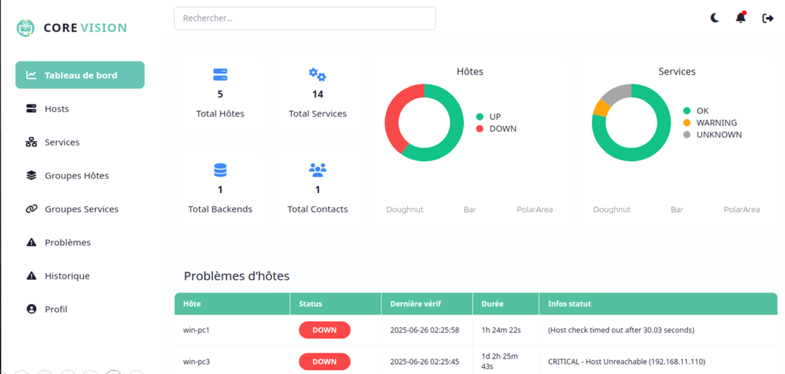

# CoreVision – Plateforme Intelligente de Supervision Réseau

<p align="center">
  
  
  
  
  
  
</p>

---

# Présentation

**CoreVision** est une plateforme web de supervision réseau développée pour centraliser la surveillance des infrastructures informatiques à travers une interface moderne, intuitive et facile à administrer.

La plateforme permet de superviser les hôtes, les services et les équipements réseau en temps réel, de consulter les alertes, de suivre l'état de santé du réseau et de simplifier les tâches des administrateurs système.

Le système s'appuie sur **Nagios Core** comme moteur de supervision, **NagiosQL** pour la gestion des configurations, **Thruk** pour la visualisation des informations de monitoring ainsi que **SNMP** et **NCPA** pour la collecte des données des équipements supervisés.

---

# Objectifs

- Superviser les équipements réseau en temps réel.
- Détecter rapidement les anomalies et les pannes.
- Centraliser les informations de supervision.
- Faciliter l'administration des infrastructures informatiques.
- Réduire le temps de réaction face aux incidents.
- Fournir une interface web simple et intuitive.

---

# Fonctionnalités

- Supervision des hôtes
- Surveillance des services
- Gestion des équipements réseau
- Tableau de bord interactif
- Détection des anomalies
- Gestion des alertes
- Consultation des journaux d'événements
- Gestion des utilisateurs
- Suivi de l'état des infrastructures
- Actualisation des données en temps réel

---

# Architecture

```text
                  Équipements Réseau
       (Serveurs, Routeurs, Switches, PC)
                      │
                SNMP / NCPA Agents
                      │
                      ▼
                Nagios Core Server
                      │
        ┌─────────────┼─────────────┐
        │             │             │
   NagiosQL       Thruk        Plugins Nagios
        │             │             │
        └─────────────┼─────────────┘
                      │
                      ▼
              Plateforme CoreVision
            (PHP • JavaScript • JSON)
                      │
                      ▼
              Interface Administrateur
```

---

# Technologies utilisées

## Langages

- PHP
- JavaScript
- HTML5
- CSS3

## Technologies Réseau

- Nagios Core
- NagiosQL
- Thruk
- SNMP
- NCPA

## Serveur

- Apache
- Ubuntu Linux

## Données

- JSON

---

# Structure du projet

```text
CoreVision/
│
├── api/                 # API et communication avec les données
├── css/                 # Feuilles de style
├── js/                  # Scripts JavaScript
├── json/                # Données JSON
├── php/                 # Scripts PHP
├── src/                 # Ressources du projet
├── uploads/             # Fichiers importés
├── index.php            # Point d'entrée de l'application
└── README.md
```

---

# Interface utilisateur

L'application offre une interface permettant de :

- consulter les hôtes supervisés ;
- surveiller les services critiques ;
- visualiser les alertes ;
- gérer les utilisateurs ;
- administrer la plateforme ;
- suivre l'état général du réseau.

<p align="center">
  <a href="demo/demonstration.mp4">
    
  </a>
</p>

<p align="center">
  Cliquez sur l'image pour regarder la démonstration.
</p>

---

# Cas d'utilisation

- Supervision des serveurs Linux
- Surveillance des équipements réseau
- Monitoring des services Web
- Gestion des incidents
- Administration des infrastructures informatiques
- Visualisation centralisée des alertes

---

# Sécurité

CoreVision permet :

- une gestion centralisée des accès ;
- une supervision continue des ressources ;
- une détection rapide des anomalies ;
- une amélioration de la disponibilité des services.
